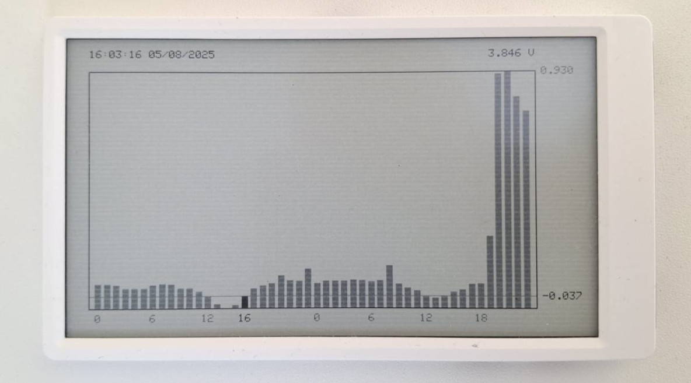

# M5Paper Electricity Price Monitor

A simple electricity price monitor for Denmark that displays current and upcoming electricity prices on an M5Paper E-Ink display. Updates hourly and uses deep sleep to maximize battery life.
Helps you save money by running appliances when electricity is cheapest!



## Why Use This?

Save money by timing your energy usage smartly:
- Run your washing machine when prices drop (clean clothes, clean conscience!)
- Charge your EV during low-price hours
- Avoid running the dishwasher during peak prices (unless you really need those clean forks)
- Perfect excuse to postpone vacuuming: "Sorry, honey, electricity's too expensive right now!" 

## Features

- Shows current and upcoming electricity prices for DK1 region
- Updates automatically every hour
- Power efficient with E-Ink display and deep sleep
- Displays:
  - Price trend visualization
  - Current time and date
  - Battery status

## Hardware Needed

- M5Paper E-Ink display
- WiFi connection

## Setup

1. Clone this repository
2. Create `WiFiCredentials.h` with your WiFi settings:
   ```cpp
   #define WIFI_SSID "your_ssid"
   #define WIFI_PASSWORD "your_password"
   ```
3. Build and upload using PlatformIO

Required libraries are automatically installed through PlatformIO.
- ESP32 Arduino framework
- M5EPD library (v0.1.5+)
- ArduinoJson (v7.3.0+)

## How It Works

1. **Initialization**: Device connects to WiFi and synchronizes time with Danish NTP servers
2. **Data Collection**: Fetches electricity prices from [elprisenligenu.dk](https://elpriserligenu.dk/) API
3. **Display**: Shows prices in a bar graph format with current price highlighted
4. **Power Management**: Enters deep sleep until the next hour
5. **Updates**: 
   - Fetches today's prices on boot
   - Gets tomorrow's prices after 13:00 (when they become available)
   - Updates display hourly

